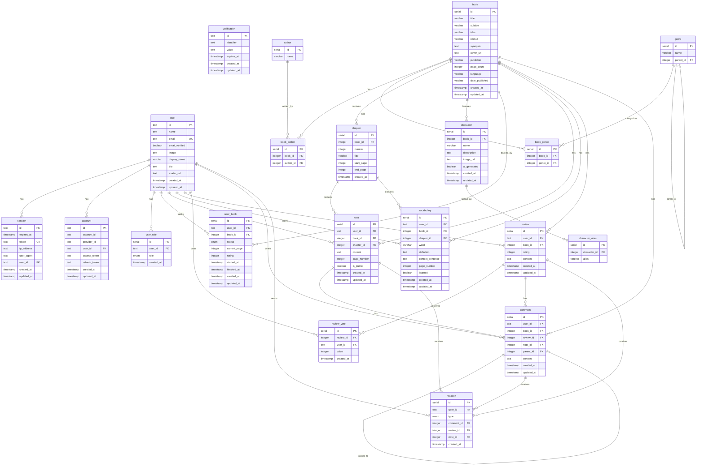
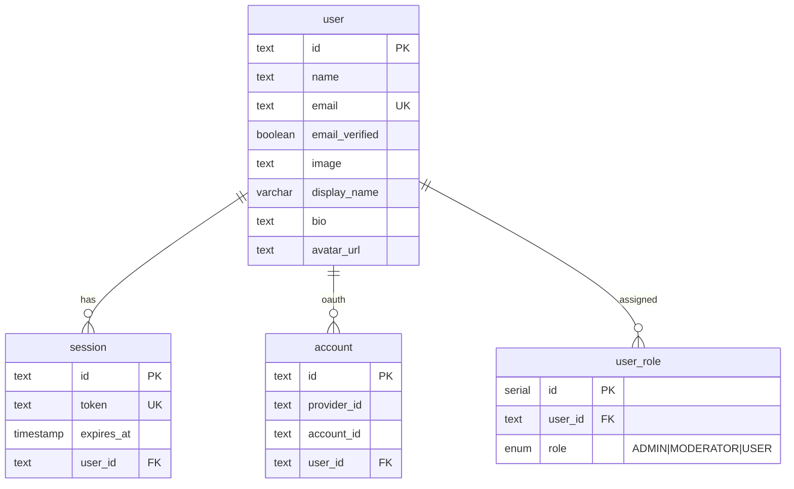
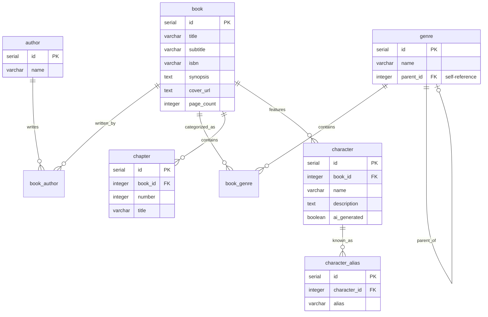
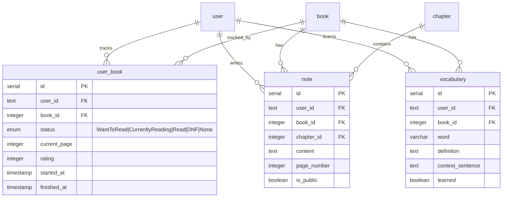
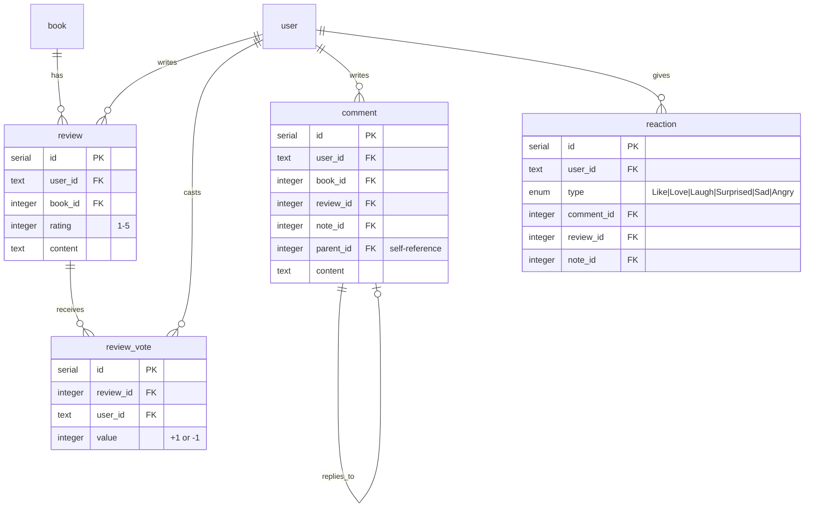

# @bookmarkd/db

Database package for Bookmarkd using Drizzle ORM with PostgreSQL.

## Database Commands

Run these commands from the root of the monorepo:

| Command | Description |
|---------|-------------|
| `bun run db:push` | Push schema changes directly to the database. **Use in development** - fast iteration without migration files. Destructive changes may cause data loss. |
| `bun run db:generate` | Generate SQL migration files from schema changes. **Use before production deploys** - creates versioned migration files in `src/migrations/`. |
| `bun run db:migrate` | Run pending migrations against the database. **Use in production** - applies migration files in order. Safe and reversible. |
| `bun run db:studio` | Open Drizzle Studio GUI in your browser. Visual database explorer for viewing and editing data. |
| `bun run db:seed` | Seed the database with sample data (books, authors, characters, etc.). Run after `db:push` or `db:migrate`. |

## When to Use Each Command

### Development Workflow

```bash
# 1. Make schema changes in src/schema/*.ts
# 2. Push changes directly to dev database
bun run db:push

# 3. (Optional) Seed with sample data
bun run db:seed

# 4. View data in browser GUI
bun run db:studio
```

### Production Workflow

```bash
# 1. Make schema changes in src/schema/*.ts
# 2. Generate migration files
bun run db:generate

# 3. Review generated SQL in src/migrations/
# 4. Commit migration files to git
# 5. In production, run migrations
bun run db:migrate
```

## Quick Reference

- **`db:push`** = Fast, direct, potentially destructive (dev only)
- **`db:generate`** + **`db:migrate`** = Safe, versioned, reversible (production)
- **`db:studio`** = Visual data browser
- **`db:seed`** = Populate with sample data

## Schema Structure

```
src/schema/
├── index.ts          # Barrel export
├── enums.ts          # PostgreSQL enums
├── auth.ts           # User, session, account (Better-Auth)
├── book.ts           # Book metadata
├── author.ts         # Authors + book_author junction
├── genre.ts          # Hierarchical genres + book_genre junction
├── chapter.ts        # Book chapters
├── character.ts      # Characters + aliases
├── user-book.ts      # Reading status/progress
├── note.ts           # Chapter-based notes
├── vocabulary.ts     # Personal word lists
├── review.ts         # Book reviews + votes
├── comment.ts        # Threaded comments
├── reaction.ts       # Reactions (like, love, etc.)
└── relations.ts      # Drizzle relations
```

## Entity Relationship Diagram

### Complete Schema Overview



### Domain-Specific Diagrams

#### Authentication & Users



#### Books & Metadata



#### User Reading Activity



#### Social Features



## Enums

| Enum | Values | Used In |
|------|--------|---------|
| `role` | ADMIN, MODERATOR, USER | user_role.role |
| `book_status` | WantToRead, CurrentlyReading, Read, DNF, None | user_book.status |
| `reaction_type` | Like, Love, Laugh, Surprised, Sad, Angry | reaction.type |

## Key Design Decisions

### Polymorphic Associations

**Comments** can be attached to multiple entity types:
- Books (general discussion)
- Reviews (discussion about reviews)
- Notes (collaboration on notes)
- Other comments (threaded replies)

**Reactions** follow the same pattern for comments, reviews, and notes.

### Self-Referential Tables

- **genre.parent_id** → Creates hierarchical genre tree (e.g., Fiction → Science Fiction → Space Opera)
- **comment.parent_id** → Enables threaded/nested comment replies

### Junction Tables

Many-to-many relationships use junction tables:
- `book_author` → Books can have multiple authors
- `book_genre` → Books can have multiple genres
